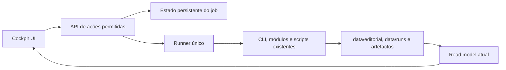

# Cockpit Control Plane V1

Status: plano aprovado para implementação futura; este documento não autoriza alterações ao pipeline.

Baseline: branch `feat/visual-cockpit`, commit `c2c51b1`. O cockpit atual é read-only, privado por Tailscale e lê os artefactos existentes sem executar o pipeline.

## Objetivo

Transformar o cockpit numa mesa editorial operacional onde Vitor consegue iniciar um conteúdo, acompanhar as etapas, tomar as decisões humanas necessárias e abrir o resultado final sem recorrer ao terminal.

O CLI continua a existir como motor, fallback operacional e superfície de diagnóstico. O UI não ganha um terminal genérico.

## Experiência V1

O primeiro percurso deve resolver um caso completo e frequente:

1. Vitor carrega em **Novo conteúdo**.
2. Introduz um URL ou tema, contexto opcional e escolhe `Blog + formatos`.
3. Confirma o resumo do trabalho e inicia o processo.
4. O cockpit mostra o progresso real:
   - Pesquisa
   - Source gate
   - Escolha de ângulo
   - Diagnóstico
   - Draft
   - Formatos
   - QA
5. O processo para quando precisa de uma decisão humana:
   - escolha do ângulo;
   - aprovação final.
6. O pacote concluído aparece nas áreas atuais do cockpit.

Cada etapa mostra apenas o que ajuda a decidir: estado, duração, aviso principal, artefactos produzidos e próxima ação.

## Âmbito da primeira versão

### Incluído

- Um processo ativo de cada vez.
- Entrada por URL ou tema.
- Um percurso editorial: pesquisa até pacote final.
- Todos os sete formatos já suportados pelo manifesto.
- Estado persistente, mesmo que o browser seja fechado.
- Progresso por polling simples a cada poucos segundos.
- Cancelar o processo ativo.
- Repetir uma etapa falhada.
- Escolher um dos ângulos sugeridos.
- Aprovar ou rejeitar o resultado final.
- Abertura automática do pacote no cockpit quando termina.
- Histórico curto dos processos recentes.
- HTML como exportação opcional, não como interface principal.

### Fora do âmbito

- Terminal ou comandos arbitrários no browser.
- Vários utilizadores, equipas, permissões ou organizações.
- Execução concorrente de vários conteúdos.
- Editor de workflows ou pipeline drag-and-drop.
- WebSockets, event bus ou infraestrutura distribuída.
- Edição colaborativa e comparação avançada de versões.
- Publicação automática em plataformas externas.
- Substituição ou reescrita geral do CLI.
- Remoção do exportador HTML existente.

## Arquitetura mínima



### 1. Cockpit

O servidor atual mantém a leitura existente e recebe uma pequena API de mutação. Não deve aceitar nomes de comandos, argumentos de shell ou caminhos fornecidos pelo utilizador.

### 2. Job

Cada processo tem uma pasta própria:

```text
data/control/jobs/<job-id>/
  job.json
  events.jsonl
```

`job.json` contém o estado atual e é escrito atomicamente. `events.jsonl` contém um histórico curto e append-only. Os conteúdos editoriais continuam nos diretórios existentes; não se cria um segundo formato de pacote.

### 3. Runner

Existe um único runner e uma fila com capacidade efetiva de um job. O runner executa apenas etapas registadas no código.

Quando for necessário usar um processo filho, deve ser usado `spawn` sem shell, com executável e argumentos definidos pelo código. A API nunca recebe uma linha de comando.

O repositório ainda não tem um comando end-to-end para produzir um blog. A primeira tarefa de implementação é criar uma única fronteira de orquestração, reutilizando o que já existe, sem mover toda a lógica do CLI:

```text
runEditorialJob(input, callbacks)
```

CLI e cockpit devem chamar essa mesma fronteira. Se uma etapa ainda depender de uma sessão interativa e não tiver um executor não interativo seguro, a implementação deve parar e tornar esse bloqueio explícito; não deve inventar um provider ou abrir execução arbitrária.

### 4. Atualização do UI

O browser consulta o estado do job por polling. SSE ou WebSockets só serão considerados se o polling demonstrar ser insuficiente.

## Modelo de estado

```text
queued
researching
source_gate
awaiting_angle
diagnosing
drafting
formatting
qa
awaiting_final_approval
completed
failed
cancelled
interrupted
```

As transições são explícitas e testadas. Um restart durante execução marca o job como `interrupted`; a V1 não retoma trabalho silenciosamente. O utilizador decide se repete a última etapa segura.

## API mínima

```text
GET  /api/jobs
GET  /api/jobs/:id
POST /api/jobs
POST /api/jobs/:id/select-angle
POST /api/jobs/:id/approve
POST /api/jobs/:id/retry
POST /api/jobs/:id/cancel
```

Não criar endpoints genéricos por etapa. As ações acima representam decisões do produto, não detalhes internos do pipeline.

## Segurança

A mudança transforma um leitor numa superfície de execução, por isso a escrita começa desativada:

```text
SCRAPE_AGENT_COCKPIT_ACTIONS=0
```

Para ativar:

- o serviço continua ligado a `127.0.0.1`;
- Tailscale Serve continua a ser a única fronteira remota;
- Funnel continua proibido;
- pedidos mutáveis exigem `POST`, JSON, same-origin e token CSRF;
- todos os payloads passam por Zod e por limites de tamanho;
- apenas operações registadas no código podem ser executadas;
- caminhos continuam contidos no data root e symlinks continuam rejeitados;
- segredos não entram no HTML, `job.json`, eventos ou logs;
- systemd ganha `ReadWritePaths` apenas para os diretórios de dados necessários;
- o código do projeto, `.env`, SSH e configurações pessoais continuam inacessíveis para escrita.

## Tratamento de erros

- Uma falha de provider termina apenas a etapa atual.
- O UI mostra uma mensagem operacional curta e mantém o detalhe técnico nos logs locais redigidos.
- Cancelamento envia primeiro uma terminação normal e só força o processo após timeout.
- Repetição reutiliza os artefactos válidos anteriores quando a etapa permite.
- Não há retries automáticos de operações pagas na V1.

## Fases de implementação

### Fase 1 — Contrato e runner

- Definir schemas de `EditorialJob`, eventos, inputs e transições.
- Criar armazenamento atómico e testes de restart/interrupção.
- Criar `runEditorialJob` e ligar as etapas existentes.
- Manter a execução acionável também pelo CLI.

Resultado: um job completo pode ser executado sem o UI.

### Fase 2 — API controlada

- Adicionar os sete endpoints.
- Aplicar validação, CSRF, limites, cancelamento e exclusão mútua.
- Usar um runner falso nos testes; os testes não chamam providers pagos.

Resultado: o browser consegue controlar um job sem acesso a comandos arbitrários.

### Fase 3 — Fluxo visual

- Adicionar **Novo conteúdo**.
- Mostrar timeline, estados, avisos e artefactos.
- Implementar escolha de ângulo, retry, cancelamento e aprovação final.
- Reutilizar o design system e as áreas atuais do cockpit.

Resultado: o percurso completo funciona em desktop e mobile.

### Fase 4 — Operação privada

- Ajustar o sandbox systemd com escrita mínima.
- Manter ações desligadas por defeito e ativá-las apenas após validação.
- Testar reboot, interrupção, Tailscale HTTPS e rollback.

Resultado: a V1 fica persistente e privada no VPS.

## Critérios de aceitação

- Um URL ou tema inicia um job a partir do cockpit.
- O UI nunca envia nem executa uma linha de shell.
- O CLI e o UI usam a mesma fronteira de orquestração.
- Só existe um job em execução.
- Fechar o browser não interrompe o trabalho.
- Reiniciar o serviço não apresenta um job interrompido como concluído.
- O source gate continua a bloquear diagnóstico quando falha.
- O estado combinado de QA continua conservador.
- O pacote final continua compatível com o read model atual.
- O serviço continua privado e responde no URL Tailscale atual.
- `npm test`, `npm run typecheck`, `npm run build` e browser QA passam.
- O pipeline atual continua funcional fora do cockpit.

## Decisões que evitam overengineering

- Um utilizador.
- Um job de cada vez.
- Polling em vez de WebSockets.
- Ficheiros atómicos em vez de base de dados.
- Um runner local em vez de filas ou serviços distribuídos.
- Endpoints de produto em vez de uma API genérica de comandos.
- Dois gates humanos em vez de um motor configurável de aprovações.
- HTML preservado como opção, sem investir mais nele durante esta fase.

## Rollback

- Desativar `SCRAPE_AGENT_COCKPIT_ACTIONS`.
- Reverter o commit da funcionalidade.
- Restaurar a unit systemd read-only anterior.
- Os pacotes existentes permanecem válidos porque a V1 não altera o formato editorial.
